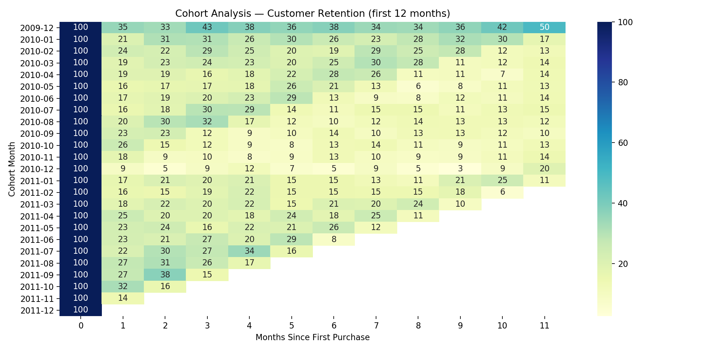
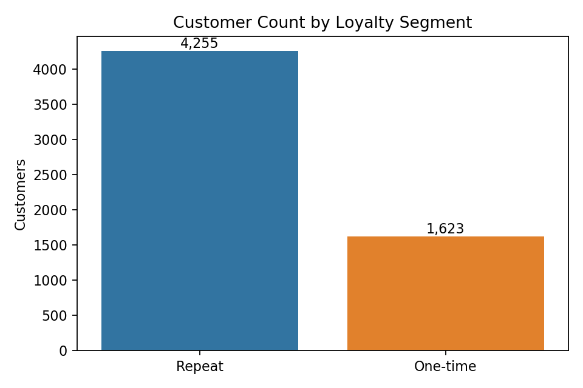
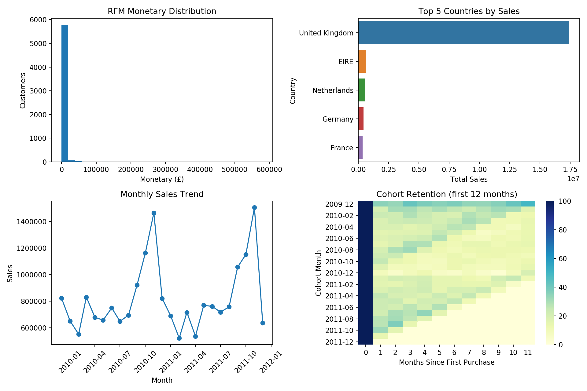

# Customer_Retention_Analysis 

📊 *Retail Case Study (Nov 2024 – Jan 2025)*  
> An end-to-end analysis of customer retention and repeat purchase behavior using SQL, Python, and Power BI mockups.  

---

## 🔍 Overview  
This project analyzes over *1M+ retail transactions* to uncover retention patterns and revenue drivers.  
The focus was on *Cohort Analysis, **RFM Segmentation, and **A/B Testing insights*, with outputs translated into dashboards and mockups to simulate business decision-making.  

---

## 🛠️ Tech & Skills  
- *SQL* – Data extraction, cleaning, cohort & RFM queries  
- *Python (Pandas, NumPy, Matplotlib)* – Data wrangling, retention analysis, lifecycle visualization  
- *Power BI (mockups)* – Customer retention dashboard, KPI summary  
- *BA/ICT Tools* – JIRA, Confluence (mock), reporting structure  
- *Business Focus* – Customer loyalty, repeat revenue (~72%), churn (~15%), strategic recommendations  

---

## 📂 Repository Structure  
- */data* → Cleaned & raw transaction data (CSV zipped due to size)  
- */notebook* → Jupyter notebook, mockups, BI pack, confluence page, exports  
- */sql* → CSV outputs from SQL queries  
- */images* → Key visuals (cohort heatmap, loyalty split, Power BI mockup)  
- */docs* → Report & supporting documentation  

---

## 📈 Key Insights  
- *72% of revenue* came from repeat customers  
- *12-month retention ~15%*, highlighting churn risks  
- Cohort analysis revealed higher retention in new loyalty members  
- RFM segmentation identified *top 20% customers driving ~65% revenue*  
- Recommended *90-day onboarding program, loyalty enhancements, CRM fixes*  

---

## 🚀 Business Relevance  
This project simulates real *Business Analyst / ICT Support work*:  
- Bridging technical analysis with business recommendations  
- Documenting insights in Confluence/JIRA mockups  
- Visualizing outcomes via BI dashboards  
- Showing end-to-end workflow from SQL → Python → BI  

---

 📊 Preview Visuals  

Cohort Retention Heatmap  
  

Customer Loyalty Split  
  

Power BI Mock Dashboard  

---

## 👤 Author  
*Dhairya Shah*  
- Business Analyst | ICT Support | Data & Analytics  
- [LinkedIn](https://linkedin.com/in/dhairrshah)
